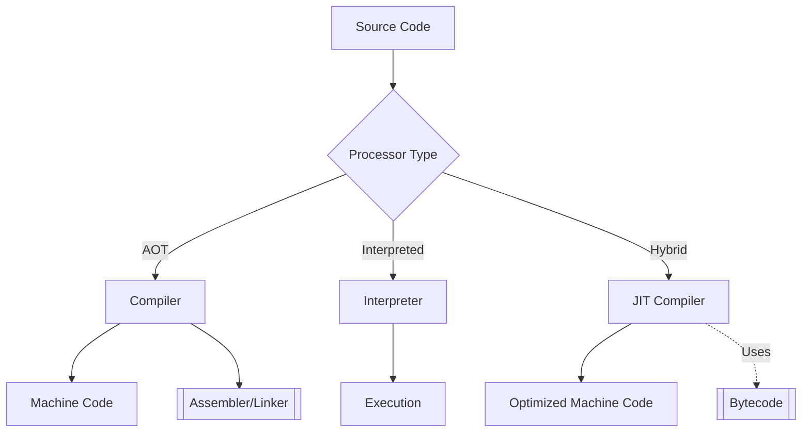

TODO: Intro

## Key Components

1. **Core Processors**  
   Directly handle code translation/execution:
   - [[Compilers]]: Transform code (e.g., C → machine code, Java → bytecode).
   - [[Interpreters]]: Execute code directly (e.g., Python, Ruby).
   - [[JIT Compilers]]: Blend compilation and interpretation for speed.

2. **Bytecode & Virtual Machines**  
   - [[Bytecode Design]]: Portable code formats (JVM, WASM).
   - [[Runtime Environments]]: Memory, garbage collection, and JIT in VMs.

3. **Build Toolchain**  
   Steps to generate executables:
   - [[Preprocessors]] → [[Assemblers]] → [[Linkers]].

4. **Internal Tooling**  
   - [[Parsers & Lexers]]: Syntax analysis (ANTLR, Lex/Yacc).
   - [[IR Formats]]: Intermediate representations (LLVM IR).

## How They Fit Together

